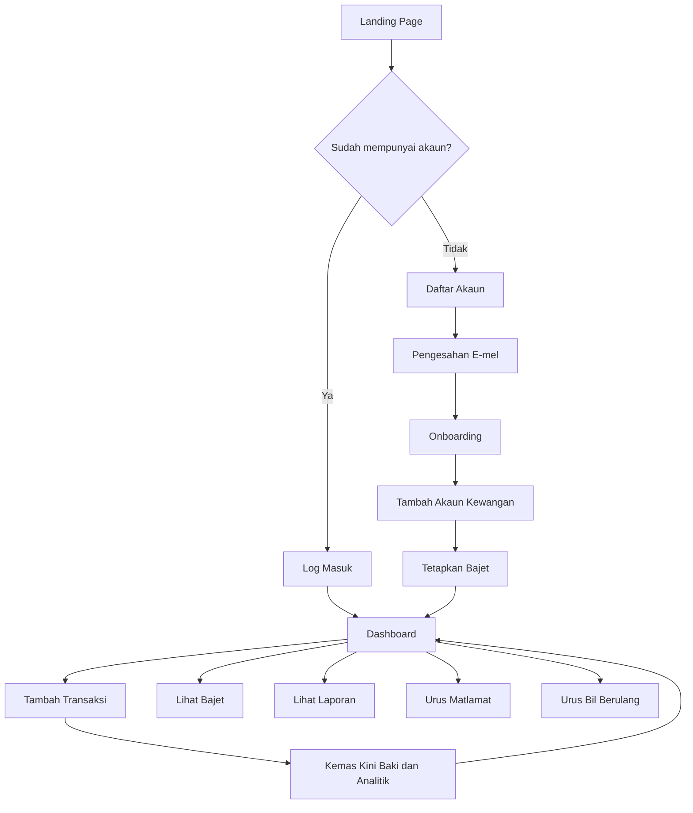
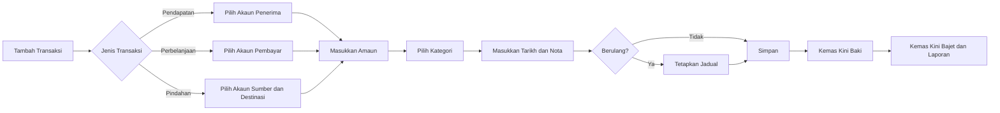
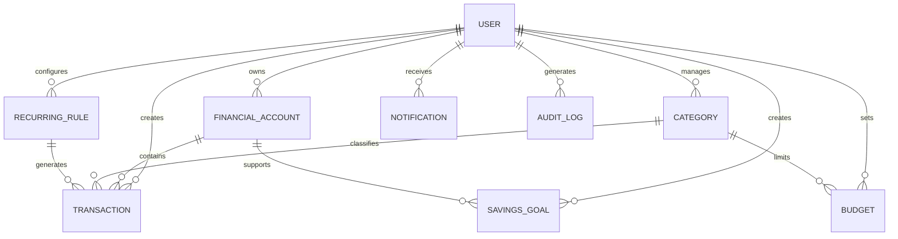

# Finance Pulse Workflow v1

> Dokumen spesifikasi dan aliran kerja untuk pembangunan aplikasi web pemantauan kewangan.

## 1. Ringkasan Projek

**Finance Pulse** ialah aplikasi web yang membantu pengguna memantau kedudukan kewangan secara ringkas, visual dan masa nyata. Aplikasi ini menggabungkan rekod pendapatan, perbelanjaan, bajet, aliran tunai, komitmen bulanan dan amaran kewangan dalam satu dashboard.

### Objektif Utama

- Memberikan gambaran kewangan semasa dalam satu paparan.
- Memudahkan rekod transaksi pendapatan dan perbelanjaan.
- Membantu pengguna merancang serta mengawal bajet.
- Menjana amaran apabila perbelanjaan melebihi had.
- Menunjukkan trend kewangan melalui carta dan laporan.
- Menyediakan asas untuk integrasi bank, e-dompet dan kecerdasan buatan.

---

## 2. Skop Versi 1

### Termasuk

- Pendaftaran dan log masuk pengguna.
- Dashboard ringkasan kewangan.
- Pengurusan akaun kewangan.
- Rekod transaksi manual.
- Kategori pendapatan dan perbelanjaan.
- Bajet bulanan.
- Matlamat simpanan.
- Komitmen dan bil berulang.
- Notifikasi dalam aplikasi.
- Laporan bulanan.
- Eksport data CSV.
- Tetapan profil dan mata wang.

### Belum Termasuk

- Sambungan terus kepada akaun bank.
- Pembayaran bil dalam aplikasi.
- Perdagangan saham atau mata wang kripto.
- Nasihat pelaburan automatik.
- Sokongan organisasi berbilang pengguna.
- Aplikasi mudah alih asli.

---

## 3. Jenis Pengguna

### Pengguna Biasa

Pengguna yang mengurus kewangan peribadi, keluarga atau perniagaan kecil.

### Pentadbir Sistem

Pentadbir yang mengurus operasi aplikasi, pengguna, kategori lalai, audit dan konfigurasi sistem.

---

## 4. Aliran Utama Pengguna



---

## 5. Workflow Onboarding

### Langkah 1 — Daftar Akaun

Maklumat diperlukan:

- Nama penuh.
- Alamat e-mel.
- Kata laluan.
- Persetujuan terhadap terma penggunaan.
- Persetujuan terhadap dasar privasi.

### Langkah 2 — Pengesahan E-mel

Sistem menghantar pautan atau kod OTP untuk mengesahkan alamat e-mel.

### Langkah 3 — Tetapan Asas

Pengguna memilih:

- Negara.
- Mata wang utama.
- Hari permulaan bulan kewangan.
- Bahasa antaramuka.
- Format tarikh.

### Langkah 4 — Tambah Akaun

Contoh akaun:

- Tunai.
- Akaun simpanan.
- Akaun semasa.
- Kad kredit.
- E-dompet.
- Akaun perniagaan.

### Langkah 5 — Tetapkan Bajet Awal

Pengguna boleh menetapkan bajet mengikut kategori seperti:

- Makanan.
- Pengangkutan.
- Rumah.
- Utiliti.
- Pendidikan.
- Kesihatan.
- Hiburan.
- Simpanan.

### Langkah 6 — Paparan Dashboard

Selepas onboarding selesai, pengguna dibawa ke dashboard utama.

---

## 6. Dashboard Utama

Dashboard perlu memaparkan maklumat berikut:

### Kad Ringkasan

- Jumlah baki keseluruhan.
- Pendapatan bulan semasa.
- Perbelanjaan bulan semasa.
- Aliran tunai bersih.
- Jumlah komitmen akan datang.
- Kemajuan matlamat simpanan.

### Visualisasi

- Carta pendapatan berbanding perbelanjaan.
- Trend aliran tunai bulanan.
- Pecahan perbelanjaan mengikut kategori.
- Kemajuan penggunaan bajet.
- Perbandingan bulan semasa dengan bulan sebelumnya.

### Tindakan Pantas

- Tambah pendapatan.
- Tambah perbelanjaan.
- Pindah wang antara akaun.
- Tambah bajet.
- Tambah bil.
- Tambah matlamat simpanan.

---

## 7. Workflow Transaksi



### Medan Transaksi

| Medan | Jenis | Wajib |
|---|---|---|
| Jenis transaksi | Pilihan | Ya |
| Akaun | Pilihan | Ya |
| Amaun | Nombor perpuluhan | Ya |
| Kategori | Pilihan | Ya |
| Tarikh | Tarikh dan masa | Ya |
| Penerangan | Teks | Tidak |
| Penerima atau peniaga | Teks | Tidak |
| Resit | Fail gambar atau PDF | Tidak |
| Tag | Senarai | Tidak |
| Transaksi berulang | Boolean | Tidak |

### Peraturan Sistem

- Amaun mesti lebih besar daripada sifar.
- Akaun sumber dan destinasi tidak boleh sama untuk pindahan.
- Kad kredit boleh mempunyai baki negatif atau baki tertunggak.
- Pindahan tidak dikira sebagai pendapatan atau perbelanjaan.
- Transaksi yang dipadam perlu direkodkan dalam audit log.

---

## 8. Workflow Bajet

1. Pengguna memilih bulan.
2. Pengguna memilih kategori.
3. Pengguna menetapkan jumlah bajet.
4. Sistem mengira jumlah perbelanjaan kategori.
5. Sistem memaparkan baki bajet.
6. Sistem menghantar amaran berdasarkan tahap penggunaan.

### Tahap Amaran

| Penggunaan | Status |
|---|---|
| 0–69% | Selamat |
| 70–89% | Perhatian |
| 90–99% | Kritikal |
| 100% dan ke atas | Melebihi bajet |

### Formula

```text
Penggunaan Bajet (%) = Jumlah Perbelanjaan / Jumlah Bajet × 100
```

---

## 9. Workflow Matlamat Simpanan

Pengguna boleh mencipta matlamat seperti dana kecemasan, percutian, pendidikan atau pembelian aset.

### Medan Matlamat

- Nama matlamat.
- Amaun sasaran.
- Amaun semasa.
- Tarikh sasaran.
- Akaun berkaitan.
- Sumbangan bulanan.
- Nota.

### Status Matlamat

- Belum bermula.
- Sedang berjalan.
- Hampir selesai.
- Selesai.
- Dijeda.

### Pengiraan Cadangan Simpanan

```text
Simpanan Bulanan Diperlukan =
(Amaun Sasaran - Amaun Semasa) / Bilangan Bulan Berbaki
```

---

## 10. Workflow Bil dan Komitmen Berulang

Contoh:

- Sewa atau ansuran rumah.
- Ansuran kenderaan.
- Bil elektrik.
- Bil air.
- Internet.
- Langganan perisian.
- Insurans.
- Pinjaman.
- Yuran pendidikan.

### Aliran Kerja

1. Pengguna menambah bil.
2. Pengguna menetapkan amaun dan tarikh akhir.
3. Pengguna memilih kekerapan.
4. Sistem menjana kejadian bil seterusnya.
5. Sistem menghantar peringatan.
6. Pengguna menandakan bil sebagai dibayar.
7. Sistem boleh mencipta transaksi secara automatik selepas pengesahan.

### Kekerapan

- Mingguan.
- Bulanan.
- Suku tahunan.
- Setengah tahun.
- Tahunan.
- Tersuai.

---

## 11. Sistem Notifikasi

### Jenis Notifikasi

- Bajet mencapai 70%, 90% atau 100%.
- Bil hampir tiba tarikh akhir.
- Bil telah lewat.
- Baki akaun rendah.
- Matlamat simpanan tertinggal daripada sasaran.
- Ringkasan kewangan mingguan.
- Laporan kewangan bulanan.
- Aktiviti log masuk baharu.
- Perubahan keselamatan akaun.

### Saluran Versi 1

- Notifikasi dalam aplikasi.
- E-mel.

### Saluran Masa Hadapan

- WhatsApp.
- Telegram.
- Push notification.
- SMS.

---

## 12. Laporan dan Analitik

### Laporan Bulanan

- Jumlah pendapatan.
- Jumlah perbelanjaan.
- Aliran tunai bersih.
- Kategori perbelanjaan terbesar.
- Perubahan berbanding bulan sebelumnya.
- Bajet yang melebihi had.
- Kemajuan simpanan.
- Komitmen akan datang.

### Penapis

- Julat tarikh.
- Akaun.
- Kategori.
- Jenis transaksi.
- Tag.
- Julat amaun.

### Format Eksport

- CSV.
- PDF pada versi seterusnya.
- Excel pada versi seterusnya.

---

## 13. Struktur Navigasi

```text
/
├── landing
├── login
├── register
├── forgot-password
├── onboarding
└── app
    ├── dashboard
    ├── accounts
    ├── transactions
    ├── budgets
    ├── goals
    ├── recurring-bills
    ├── reports
    ├── notifications
    └── settings
```

### Navigasi Utama

- Dashboard.
- Transaksi.
- Bajet.
- Matlamat.
- Bil.
- Laporan.
- Tetapan.

---

## 14. Cadangan Teknologi

### Frontend

- Next.js.
- TypeScript.
- Tailwind CSS.
- shadcn/ui.
- React Hook Form.
- Zod.
- Recharts atau Chart.js.
- TanStack Query.

### Backend

Pilihan A:

- Next.js Server Actions dan Route Handlers.

Pilihan B:

- NestJS sebagai backend berasingan.

### Pangkalan Data

- PostgreSQL.
- Prisma ORM.

### Authentication

- Auth.js.
- Google OAuth.
- E-mel dan kata laluan.
- Magic link sebagai pilihan.

### Infrastruktur

- Vercel untuk frontend.
- Supabase, Neon atau Railway untuk PostgreSQL.
- Cloudflare R2 atau AWS S3 untuk resit.
- Resend untuk e-mel.
- Sentry untuk pemantauan ralat.

---

## 15. Model Data

### User

```text
id
name
email
password_hash
email_verified_at
currency
locale
timezone
created_at
updated_at
```

### FinancialAccount

```text
id
user_id
name
type
currency
opening_balance
current_balance
credit_limit
is_active
created_at
updated_at
```

### Category

```text
id
user_id
name
type
icon
color
is_system
parent_id
created_at
updated_at
```

### Transaction

```text
id
user_id
account_id
destination_account_id
category_id
type
amount
currency
transaction_date
merchant
description
receipt_url
is_recurring
recurring_rule_id
created_at
updated_at
deleted_at
```

### Budget

```text
id
user_id
category_id
month
year
amount
alert_threshold
created_at
updated_at
```

### SavingsGoal

```text
id
user_id
account_id
name
target_amount
current_amount
target_date
monthly_contribution
status
created_at
updated_at
```

### RecurringRule

```text
id
user_id
name
type
amount
frequency
interval
start_date
end_date
next_run_at
account_id
category_id
is_active
created_at
updated_at
```

### Notification

```text
id
user_id
type
title
message
is_read
action_url
created_at
read_at
```

### AuditLog

```text
id
user_id
action
entity_type
entity_id
metadata
ip_address
user_agent
created_at
```

---

## 16. Hubungan Data



---

## 17. Cadangan API

### Authentication

```http
POST /api/auth/register
POST /api/auth/login
POST /api/auth/logout
POST /api/auth/verify-email
POST /api/auth/forgot-password
POST /api/auth/reset-password
```

### Accounts

```http
GET    /api/accounts
POST   /api/accounts
GET    /api/accounts/:id
PATCH  /api/accounts/:id
DELETE /api/accounts/:id
```

### Transactions

```http
GET    /api/transactions
POST   /api/transactions
GET    /api/transactions/:id
PATCH  /api/transactions/:id
DELETE /api/transactions/:id
POST   /api/transactions/import
GET    /api/transactions/export
```

### Budgets

```http
GET    /api/budgets
POST   /api/budgets
PATCH  /api/budgets/:id
DELETE /api/budgets/:id
GET    /api/budgets/status
```

### Goals

```http
GET    /api/goals
POST   /api/goals
PATCH  /api/goals/:id
DELETE /api/goals/:id
POST   /api/goals/:id/contributions
```

### Reports

```http
GET /api/reports/dashboard
GET /api/reports/monthly
GET /api/reports/cash-flow
GET /api/reports/categories
```

---

## 18. Struktur Folder Cadangan

```text
finance-pulse/
├── app/
│   ├── (auth)/
│   │   ├── login/
│   │   ├── register/
│   │   └── forgot-password/
│   ├── (dashboard)/
│   │   ├── dashboard/
│   │   ├── accounts/
│   │   ├── transactions/
│   │   ├── budgets/
│   │   ├── goals/
│   │   ├── recurring-bills/
│   │   ├── reports/
│   │   └── settings/
│   └── api/
├── components/
│   ├── dashboard/
│   ├── transactions/
│   ├── budgets/
│   ├── charts/
│   ├── forms/
│   └── ui/
├── lib/
│   ├── auth/
│   ├── database/
│   ├── validations/
│   ├── calculations/
│   └── notifications/
├── prisma/
│   ├── schema.prisma
│   └── seed.ts
├── public/
├── tests/
├── .env.example
├── README.md
└── package.json
```

---

## 19. Keselamatan

- Hash kata laluan menggunakan Argon2id atau bcrypt.
- Gunakan HTTPS untuk semua komunikasi.
- Gunakan session cookie yang `httpOnly`, `secure` dan `sameSite`.
- Laksanakan rate limiting untuk log masuk dan API.
- Gunakan validasi skema pada frontend dan backend.
- Pastikan semua query ditapis menggunakan `user_id`.
- Gunakan kawalan akses berasaskan peranan.
- Simpan audit log untuk tindakan sensitif.
- Jangan simpan nombor kad penuh atau CVV.
- Enkripsi data sensitif ketika transit dan ketika disimpan.
- Sediakan fungsi eksport serta pemadaman data pengguna.
- Laksanakan perlindungan CSRF, XSS dan SQL injection.
- Jalankan dependency scanning dan secret scanning.

---

## 20. Keperluan Bukan Fungsian

### Prestasi

- Dashboard dimuatkan dalam kurang daripada 3 saat pada sambungan biasa.
- API utama memberikan respons kurang daripada 500 ms bagi operasi biasa.
- Gunakan pagination untuk transaksi.
- Gunakan cache untuk data analitik yang mahal.

### Kebolehgunaan

- Responsif untuk desktop, tablet dan telefon.
- Sokongan papan kekunci.
- Kontras warna yang jelas.
- Borang mempunyai mesej ralat yang mudah difahami.
- Antaramuka mengikut prinsip aksesibiliti WCAG 2.1 AA.

### Kebolehpercayaan

- Backup pangkalan data secara berkala.
- Logging untuk ralat aplikasi.
- Pemantauan uptime.
- Mekanisme idempotency untuk transaksi berulang.

---

## 21. Logik Pengiraan Utama

### Aliran Tunai Bersih

```text
Aliran Tunai Bersih = Jumlah Pendapatan - Jumlah Perbelanjaan
```

### Nilai Bersih

```text
Nilai Bersih = Jumlah Aset - Jumlah Liabiliti
```

### Baki Akaun

```text
Baki Semasa =
Baki Pembukaan
+ Jumlah Pendapatan
- Jumlah Perbelanjaan
+ Pindahan Masuk
- Pindahan Keluar
```

### Kadar Simpanan

```text
Kadar Simpanan (%) =
(Pendapatan - Perbelanjaan) / Pendapatan × 100
```

---

## 22. Acceptance Criteria MVP

### Authentication

- Pengguna boleh mendaftar dan log masuk.
- Pengguna tidak boleh mengakses dashboard tanpa sesi sah.
- Pengguna boleh menetapkan semula kata laluan.

### Akaun

- Pengguna boleh mencipta, mengemas kini dan menyahaktifkan akaun.
- Baki akaun berubah selepas transaksi direkodkan.

### Transaksi

- Pengguna boleh menambah pendapatan, perbelanjaan dan pindahan.
- Pengguna boleh mencari dan menapis transaksi.
- Pengguna boleh mengedit dan memadam transaksi.

### Bajet

- Pengguna boleh menetapkan bajet mengikut kategori dan bulan.
- Sistem menunjukkan penggunaan bajet secara masa nyata.
- Sistem mencipta amaran apabila had dicapai.

### Laporan

- Dashboard memaparkan data bulan semasa.
- Laporan boleh ditapis mengikut julat tarikh.
- Data transaksi boleh dieksport sebagai CSV.

---

## 23. Pelan Pembangunan

### Fasa 1 — Foundation

- Sediakan repositori.
- Konfigurasi Next.js dan TypeScript.
- Konfigurasi PostgreSQL dan Prisma.
- Sediakan authentication.
- Bina reka letak dashboard.
- Sediakan sistem reka bentuk.

### Fasa 2 — Core Finance

- Modul akaun.
- Modul kategori.
- Modul transaksi.
- Pengiraan baki.
- Penapisan dan carian.

### Fasa 3 — Planning

- Modul bajet.
- Modul matlamat simpanan.
- Modul bil berulang.
- Sistem notifikasi.

### Fasa 4 — Analytics

- Carta dashboard.
- Laporan bulanan.
- Perbandingan tempoh.
- Eksport CSV.

### Fasa 5 — Hardening

- Ujian unit dan integrasi.
- Audit keselamatan.
- Penambahbaikan prestasi.
- Aksesibiliti.
- Dokumentasi.
- Pelancaran MVP.

---

## 24. Cadangan User Stories

```text
Sebagai pengguna,
saya mahu melihat jumlah baki semua akaun
supaya saya memahami kedudukan kewangan semasa.
```

```text
Sebagai pengguna,
saya mahu merekodkan perbelanjaan dengan cepat
supaya laporan kewangan saya sentiasa tepat.
```

```text
Sebagai pengguna,
saya mahu menerima amaran apabila bajet hampir habis
supaya saya boleh mengawal perbelanjaan.
```

```text
Sebagai pengguna,
saya mahu menetapkan matlamat simpanan
supaya saya dapat mengukur kemajuan kewangan.
```

```text
Sebagai pengguna,
saya mahu melihat bil yang akan tiba
supaya saya tidak terlepas tarikh pembayaran.
```

---

## 25. Environment Variables

```env
DATABASE_URL=
AUTH_SECRET=
AUTH_GOOGLE_ID=
AUTH_GOOGLE_SECRET=
RESEND_API_KEY=
EMAIL_FROM=
STORAGE_BUCKET=
STORAGE_ACCESS_KEY=
STORAGE_SECRET_KEY=
SENTRY_DSN=
APP_URL=http://localhost:3000
```

> Jangan simpan nilai rahsia sebenar di dalam repositori Git.

---

## 26. Arahan Permulaan Projek

```bash
npx create-next-app@latest finance-pulse   --typescript   --tailwind   --eslint   --app   --src-dir

cd finance-pulse

npm install prisma @prisma/client zod react-hook-form   @hookform/resolvers @tanstack/react-query recharts

npx prisma init
```

---

## 27. Definisi Siap

Satu fungsi dianggap siap apabila:

- Kod telah disemak.
- Ujian berkaitan lulus.
- Validasi input tersedia.
- Keadaan loading, kosong dan ralat tersedia.
- Antaramuka responsif.
- Kawalan akses telah diuji.
- Dokumentasi dikemas kini.
- Tiada ralat kritikal dalam pemantauan.

---

## 28. Roadmap Selepas v1

- Integrasi Open Banking.
- Import penyata bank automatik.
- Pengimbasan resit menggunakan OCR.
- Kategorisasi transaksi menggunakan AI.
- Ramalan aliran tunai.
- Cadangan pengurangan perbelanjaan.
- Dashboard keluarga atau organisasi.
- Aplikasi mudah alih.
- Sokongan berbilang mata wang.
- Integrasi WhatsApp dan Telegram.
- Modul invois untuk perniagaan kecil.
- API awam dan webhook.

---

## 29. Prinsip Produk

> Finance Pulse perlu menjadikan data kewangan mudah difahami, mudah diurus dan membantu pengguna mengambil tindakan yang lebih baik.

Keutamaan produk:

1. Keselamatan.
2. Ketepatan data.
3. Kesederhanaan pengalaman pengguna.
4. Kelajuan merekod transaksi.
5. Kejelasan laporan.
6. Privasi pengguna.

---

**Versi dokumen:** 1.0  
**Nama projek:** Finance Pulse  
**Status:** Draft pembangunan MVP
